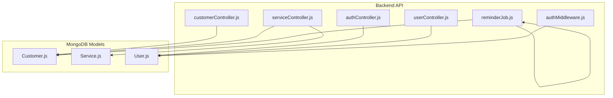

# Water-Soution

Water-Soution is a backend service for managing customers, service scheduling, worker accounts, and notifications for a water services business. The backend is designed with modular controllers, models, authentication, and scheduled reminders to support efficient business operations.

> [!NOTE]
> All API endpoints, models, and utilities are implemented in JavaScript using Node.js, Express, and MongoDB.

---

## Introduction

Water-Soution provides a comprehensive backend for a water delivery and service management business. It supports secure authentication, CRUD operations for customers, service scheduling and completion, worker management, and automated or manual message notifications via WhatsApp and SMS. The system uses role-based access control and integrates with persistent storage via MongoDB.

Key backend areas include:
- Customer management
- Service workflow and scheduling
- Worker/Owner user management
- Authentication via PINs
- Messaging and reminder automation

---

## Features

- **Authentication**: Secure login for owners and workers via PIN; JWT token-based session handling.
- **Customer Management**: Full CRUD for customers; track address, phone, service intervals, service history.
- **Service Scheduling**: Manage pending and completed services, assign workers, auto-update next service dates.
- **Worker Management**: Owner-controlled creation, update, and deletion of worker accounts; PIN management.
- **Role-Based Access**: Authorization middleware restricts sensitive routes to owners or authenticated users.
- **Notifications**: Send WhatsApp/SMS reminders for pending or scheduled services, both automatically and manually.
- **Automated Reminders**: Background job periodically checks and notifies overdue customers.
- **RESTful API Design**: Clean, structured endpoints for all business workflows.
- **Extensible Models**: Modular MongoDB schemas for Customer, Service, and User.

---

## Requirements

To run Water-Soution, you need:

- **Node.js** (ES modules enabled)
- **MongoDB** (running instance, with connection URI)
- **npm** (for dependency management)
- **Environment Variables**:
  - `MONGO_URI`: MongoDB connection string
  - `JWT_SECRET`: Secret for JWT token signing
  - Any messaging service credentials as required by `messageService.js`

> [!TIP]
> See `backend/package.json` for a full list of dependencies.

---

## Installation

Follow these steps to set up the backend:

```steps
1. Clone Repository | Clone the Water-Soution repository to your local machine.
2. Install Dependencies | Run `npm install` inside the `backend` directory to install required packages.
3. Set Environment | Create a `.env` file in `backend/` with your `MONGO_URI` and `JWT_SECRET`.
4. Start Server | Run `node index.js` (or use a process manager). The server will listen on `PORT` (default 5000).
```

> [!IMPORTANT]
> The backend expects a running MongoDB instance and valid environment variables for proper operation.

---

## Usage

Once running, the backend exposes RESTful API endpoints for all business operations.

### API Overview

- **Authentication**: `/auth/login` (PIN-based login)
- **Customers**: `/customers/` (CRUD, reminders)
- **Services**: `/services/` (create, list pending, complete)
- **Users**: `/users/` (owner bootstrap, login, workers CRUD, change pin)

All endpoints accept and return JSON. Use an HTTP client (like Postman) for testing and integration.

> [!WARNING]
> Role-based restrictions apply to sensitive actions (worker management, customer mutations).

---

## Configuration

Configuration is managed via environment variables:

- `MONGO_URI`
  MongoDB connection string used by `mongoose.connect()` in `backend/index.js`.

- `JWT_SECRET`
  Signing secret for JWT tokens, used in `authController.js` and `userController.js`.

- **Messaging Service Settings**
  Any required keys or endpoints for WhatsApp/SMS integration must be provided as required by `backend/utils/messageService.js`.

> [!CAUTION]
> Do not commit your `.env` file or sensitive credentials to version control.

---

## API Reference

### Authentication Endpoints

#### Login with PIN (`POST /auth/login`)
```api
{
  "title": "Login With PIN",
  "description": "Authenticate a user with their PIN and receive a JWT token.",
  "method": "POST",
  "baseUrl": "http://localhost:5000",
  "endpoint": "/auth/login",
  "headers": [],
  "queryParams": [],
  "pathParams": [],
  "bodyType": "json",
  "requestBody": "{\n  \"pin\": \"1234\"\n}",
  "responses": {
      "200": {
          "description": "Login successful",
          "body": "{\n  \"token\": \"<jwt>\",\n  \"role\": \"owner\",\n  \"name\": \"John Doe\"\n}"
      },
      "401": {
          "description": "Invalid PIN",
          "body": "{ \"message\": \"Invalid PIN\" }"
      }
  }
}
```

### Customer Endpoints

#### Get Customers (`GET /customers/`)
```api
{
  "title": "Get Customers",
  "description": "Retrieve a list of all customers.",
  "method": "GET",
  "baseUrl": "http://localhost:5000",
  "endpoint": "/customers/",
  "headers": [],
  "queryParams": [],
  "pathParams": [],
  "bodyType": "none",
  "responses": {
      "200": {
          "description": "Success",
          "body": "[{ \"_id\": \"...\", \"name\": \"...\", \"phone\": \"...\" }]"
      }
  }
}
```

#### Add Customer (`POST /customers/add`)
```api
{
  "title": "Add Customer",
  "description": "Add a new customer record.",
  "method": "POST",
  "baseUrl": "http://localhost:5000",
  "endpoint": "/customers/add",
  "headers": [],
  "queryParams": [],
  "pathParams": [],
  "bodyType": "json",
  "requestBody": "{\n  \"name\": \"Alice\",\n  \"phone\": \"+1234567890\",\n  \"address\": \"123 Main St\",\n  \"lastServiceDate\": \"2024-05-01\",\n  \"serviceIntervalDays\": 30\n}",
  "responses": {
      "201": {
          "description": "Customer created",
          "body": "{ \"_id\": \"...\", \"name\": \"Alice\" }"
      },
      "400": {
          "description": "Validation error",
          "body": "{ \"message\": \"Error details\" }"
      }
  }
}
```

#### Update Customer (`PUT /customers/:id`)
```api
{
  "title": "Update Customer",
  "description": "Update existing customer details.",
  "method": "PUT",
  "baseUrl": "http://localhost:5000",
  "endpoint": "/customers/:id",
  "headers": [],
  "queryParams": [],
  "pathParams": [
    { "key": "id", "value": "Customer ID", "required": true }
  ],
  "bodyType": "json",
  "requestBody": "{\n  \"name\": \"Bob\"\n}",
  "responses": {
      "200": {
          "description": "Customer updated",
          "body": "{ \"_id\": \"...\", \"name\": \"Bob\" }"
      },
      "404": {
          "description": "Customer not found",
          "body": "{ \"message\": \"Customer not found\" }"
      }
  }
}
```

#### Delete Customer (`DELETE /customers/:id`)
```api
{
  "title": "Delete Customer",
  "description": "Delete a customer by ID.",
  "method": "DELETE",
  "baseUrl": "http://localhost:5000",
  "endpoint": "/customers/:id",
  "headers": [],
  "queryParams": [],
  "pathParams": [
    { "key": "id", "value": "Customer ID", "required": true }
  ],
  "bodyType": "none",
  "responses": {
      "200": {
          "description": "Customer deleted",
          "body": "{ \"message\": \"Customer deleted\" }"
      },
      "404": {
          "description": "Customer not found",
          "body": "{ \"message\": \"Customer not found\" }"
      }
  }
}
```

#### Send Manual Reminder (`POST /customers/:id/send-reminder`)
```api
{
  "title": "Send Manual Reminder",
  "description": "Manually send a WhatsApp/SMS reminder to a customer.",
  "method": "POST",
  "baseUrl": "http://localhost:5000",
  "endpoint": "/customers/:id/send-reminder",
  "headers": [],
  "queryParams": [],
  "pathParams": [
    { "key": "id", "value": "Customer ID", "required": true }
  ],
  "bodyType": "none",
  "responses": {
      "200": {
          "description": "Reminder sent",
          "body": "{ \"message\": \"Reminder sent\" }"
      }
  }
}
```

### Service Endpoints

#### Create Service (`POST /services/`)
```api
{
  "title": "Create Service",
  "description": "Create a new service for a customer.",
  "method": "POST",
  "baseUrl": "http://localhost:5000",
  "endpoint": "/services/",
  "headers": [
    { "key": "Authorization", "value": "Bearer <token>", "required": true }
  ],
  "queryParams": [],
  "pathParams": [],
  "bodyType": "json",
  "requestBody": "{\n  \"customerId\": \"...\",\n  \"serviceDate\": \"2024-06-01\",\n  \"assignedWorkerId\": \"...\"\n}",
  "responses": {
      "201": {
          "description": "Service created",
          "body": "{ \"_id\": \"...\", \"status\": \"pending\" }"
      },
      "400": {
          "description": "Missing required fields",
          "body": "{ \"message\": \"Missing required fields\" }"
      }
  }
}
```

#### Get Pending Services (`GET /services/pending`)
```api
{
  "title": "Get Pending Services",
  "description": "List all pending services for the authenticated user.",
  "method": "GET",
  "baseUrl": "http://localhost:5000",
  "endpoint": "/services/pending",
  "headers": [
    { "key": "Authorization", "value": "Bearer <token>", "required": true }
  ],
  "queryParams": [],
  "pathParams": [],
  "bodyType": "none",
  "responses": {
      "200": {
          "description": "List of pending services",
          "body": "[{ \"_id\": \"...\", \"customerId\": { \"name\": \"...\" } }]"
      }
  }
}
```

#### Complete Service (`PATCH /services/:id/complete`)
```api
{
  "title": "Complete Service",
  "description": "Mark a service as completed for a customer.",
  "method": "PATCH",
  "baseUrl": "http://localhost:5000",
  "endpoint": "/services/:id/complete",
  "headers": [
    { "key": "Authorization", "value": "Bearer <token>", "required": true }
  ],
  "queryParams": [],
  "pathParams": [
    { "key": "id", "value": "Service ID", "required": true }
  ],
  "bodyType": "json",
  "requestBody": "{ \"intervalDays\": 30 }",
  "responses": {
      "200": {
          "description": "Service completed",
          "body": "{ \"message\": \"Service marked as completed\" }"
      },
      "400": {
          "description": "Already completed or invalid interval",
          "body": "{ \"message\": \"Already completed\" }"
      }
  }
}
```

### User Endpoints

#### Bootstrap Owner (`POST /users/bootstrap-owner`)
```api
{
  "title": "Bootstrap Owner",
  "description": "Create the initial owner account (once only).",
  "method": "POST",
  "baseUrl": "http://localhost:5000",
  "endpoint": "/users/bootstrap-owner",
  "headers": [],
  "queryParams": [],
  "pathParams": [],
  "bodyType": "json",
  "requestBody": "{ \"name\": \"Owner\", \"phone\": \"+1234567890\", \"pin\": \"1234\" }",
  "responses": {
    "200": {
      "description": "Owner created",
      "body": "{ \"message\": \"Owner created successfully\", \"owner\": { \"_id\": \"...\" } }"
    },
    "400": {
      "description": "Owner already exists",
      "body": "{ \"message\": \"Owner already exists\" }"
    }
  }
}
```

#### Login (`POST /users/login`)
```api
{
  "title": "User Login",
  "description": "Login as an owner or worker using phone and pin.",
  "method": "POST",
  "baseUrl": "http://localhost:5000",
  "endpoint": "/users/login",
  "headers": [],
  "queryParams": [],
  "pathParams": [],
  "bodyType": "json",
  "requestBody": "{ \"phone\": \"+1234567890\", \"pin\": \"1234\" }",
  "responses": {
    "200": {
      "description": "Login successful",
      "body": "{ \"token\": \"<jwt>\", \"role\": \"worker\", \"name\": \"...\", \"phone\": \"...\" }"
    },
    "401": {
      "description": "Invalid credentials",
      "body": "{ \"message\": \"Invalid credentials\" }"
    }
  }
}
```

---

## Architecture Overview

The backend is organized as follows:



---

## Source Structure

- `backend/controllers/`: Route handler logic for authentication, customers, services, and users.
- `backend/routes/`: Express routers mapping API endpoints to controllers.
- `backend/models/`: Mongoose models for persistent entities (Customer, Service, User).
- `backend/utils/`: Utility libraries for messaging (WhatsApp/SMS) and scheduled tasks.
- `backend/middleware/`: Middleware for authentication and authorization.
- `backend/index.js`: Main Express app entrypoint and server bootstrap.

---

## License

See the `backend/package.json` for license information.

---

> [!TIP]
> For more details, see the code in each respective directory (`backend/controllers/`, `backend/routes/`, `backend/models/`, etc.).
